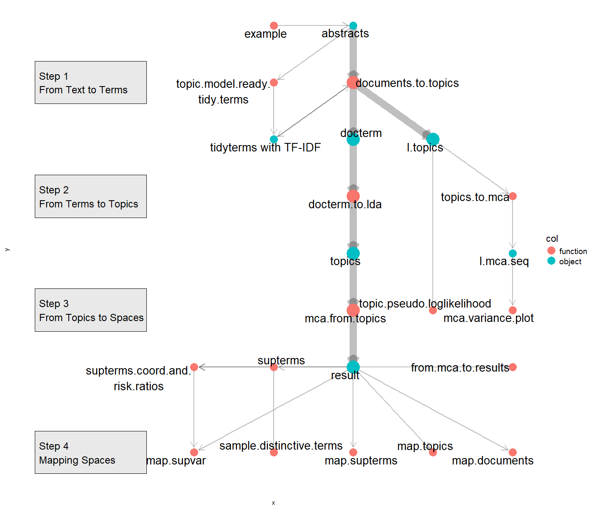

```{r, include = FALSE}
knitr::opts_chunk$set(
  collapse = TRUE,
  comment = "#>"
)
```

## Installation

To install the `topicspace` package, please follow the instructions below:

```{r setup}
# Install topicspace from GitHub
# devtools::install_github("BenzPierre/topicspace")
library(topicspace)
```

## Introduction

The `topicspace` package is designed for social scientists interested in the relationship between discursive and social structures. It provides functions for pre-processing textual data, performing topic modeling, and mapping topic spaces by combining Latent Dirichlet Allocation (LDA) with Multiple Correspondence Analysis (MCA). This package is currently under development.

This approach aims to enhance our understanding of the hierarchies among topics providing measures of the extent to which topics vary in their contribution to structuring topic spaces along several dimensions. Following the operational principles of MCA (Le Roux and Rouanet, 2004; Hjellbrekke, 2018), topics form the 'cloud of active variables,' while documents are represented in the 'cloud of individuals.' This allows for considering sufficiently prevalent terms as supplementary variables, referred to as 'supplementary terms,' for which we can calculate coordinates within the topic space. A distinctive feature of the package is its capability to calculate the risk ratio of these prevalent terms to be associated with both documents and author-related specific variables (Kropp and Larsen, 2023; Rossier et al., 2023; Benz et al., 2024).

### Overlook of the package structure

The package is structured into four parametrable blocks of functions. These blocks are sequential and are referred to as 'steps' to reflect their order of execution.

-   **Step 1. From Text to Terms** includes the necessary work of transforming raw text data into a structured format, facilitating further topic modeling. It includes the TF, IDF and TF-IDF, and the document-term matrix (DTM). In addition, this step provides the elements needed for further evaluation of different models (depending on various number of topics (*k*) and MCA cut-offs).

-   **Step 2. From Terms to Topics** proceeds to the LDA from a defined number of topics (*k*). The operation utilizes the 'text2vec' package for R by Selivanov et al. (2020) (<https://cran.r-project.org/web/packages/text2vec/index.html>).

-   **Step 3. From Topics to Spaces** runs MCA to the document-by-topic matrix resulting from Step 2. This critical transformation entails establishing thresholds that categorize topics for each document. As a result, the output reflects a binary assignment (presence or absence of a topic) rather than probabilities. MCA is conducted using the 'soc.ca' package for R by Larsen et al. (2021) (<https://cran.r-project.org/web/packages/soc.ca/index.html>).

-   **Step 4. Mapping Spaces** displays several function to map spaces of topics, documents, supplementary terms and the risk ratios according to documents or authors-based variables.

Each step is attributed one principal function. Here is the straightforward workflow of the `topicspace` package:

```{r}
#| echo: true
#| message: false
#| warning: false
### not run
# Step 1. From Text to Terms
# tm_list <- documents.to.topics(abstracts)

# Step 2. From Terms to Topics
# topics <- docterm.to.lda(tm_list[[3]])

# Step 3. From Topics to Spaces
# res <- mca.from.topics(topics)

# Step 4. Mapping spaces
# map.topics(res, tm_list[[3]])
```

Figure 1 summarizes the different functions and resulting objects, which are often required as inputs for further operations.

{width="700"}

This vignette provides a detailed explanation of these steps, as well as several additional functions designed to explore each step in greater depth. Furthermore, the package offers a 'wrapping' function that consolidates the main outputs for easier interpretation, as well as additional functions for evaluating how different number of topics (*k*) influence the construction of topic spaces and the explained variance of the models.

### Zotero example

A dataset of scientific journal abstracts exported directly from Zotero. The necessary recodes are included here so that it is easier to replicate on your own Zotero library.

```{r}
#| echo: false
#| message: false
#| warning: false
# Load example abstracts data
data(abstracts)
# Set minimum requirements for abstract data
example(abstracts)
```

## Step 1. From Text to Terms

The first step consists in pre-processing the raw text data into tidy format that is suitable for LDA processing (see Step 2).

The `topic.model.ready.tidy.terms()` function tokenizes and cleans the raw text data. It then calculates three key metrics for text analysis: term frequency (TF), inverse document frequency (IDF), and term frequency-inverse document frequency (TF-IDF).

```{r}
#| echo: true
#| message: false
#| warning: false
# Run function with default settings
# topic.model.ready.tidy.terms(abstracts, long.label = FALSE, add.titles = TRUE)
tidyterms <- topic.model.ready.tidy.terms(abstracts)
head(tidyterms)
```

The `documents.to.topics()` function is the core of this process. It takes a dataframe of documents (see ?abstracts) and generates multiple topic models using Latent Dirichlet Allocation (LDA) from a sequence of different number of topics (*k*) to implement in the model (`lda.k.seq)`.

The function returns a list with three components:

-   **`l.topics`**: A list of topic models, each with a different number of topics based on the sequence provided in `lda.k.seq`.

-   **`tidyterms`**: A tibble of the cleaned terms after applying necessary pre-processing steps. This is the same object as from the `topic.model.ready.tidy.terms()` function.

-   **`docterm`**: The document-term matrix, where rows are documents, columns are terms, and values represent term frequencies in each document.

```{r}
# Run function with default settings
# documents.to.topics(abstracts, label = "", lda.k.seq = seq(from = 50, to = 200, by = 50), lda.prune.row = 25, lda.prune.col = 5, filter.terms = NULL)
tm_list <- documents.to.topics(abstracts)
head(tm_list[[1]]$`50`) # l.topics
head(tm_list[[2]]) # tidyterms
tm_list[[3]] # docterm
```

To know more about how to inspect the different outputs depending on the different numbers of topics (k) and different MCA cut-off, see the 'Additional functions' section. In the next steps, we refer to the elements of the list: tm_list[[1]] -\> l.topics, tm_list[[3]] -\> docterm.

## Step 2. From Terms to Topics

The second step performs LDA, once a number of topics (*k*) has been chosen.

The `docterm.to.lda()` function generates the LDA model from a chosen number of topics (*k*), based on the document-term matrix (`docterm`) generated by the `documents.to.topics()` function. The LDA is performed using the 'text2vec' package for R by Dmitriy Selivanov (<https://cran.r-project.org/web/packages/text2vec/index.html>).

```{r}
# Run function with default settings
# docterm.to.lda(topics, n_topics = 100)
topics <- docterm.to.lda(tm_list[[3]])
head(topics)
```

## Step 3. From Topics to Spaces

The third step performs MCA from the LDA results.

The function `mca.from.topics()` performs MCA on the distribution of topics across documents, allowing us to filter out less significant topics based on a specified cut-off threshold (`s`).

```{r}
# Run the function with default settings
# mca.from.topics(topics, s = 0.01, small = FALSE)
res <- mca.from.topics(topics)
res
```

You can use different functions from the 'soc.ca' package for R by Larsen et al. (2021) to get MCA metrics (<https://cran.r-project.org/web/packages/soc.ca/index.html>).

```{r}
# Get variance and contributions
soc.ca::variance(res)
soc.ca::contribution(res, dim = 1)
```

After performing MCA, you can further explore the topic space by extracting the most distinctive terms from your document-term matrix using the `sample.distinctive.terms()` function. The resulting tibble displays the frequency and coordinates of the distinctive terms.

```{r}
# sample.distinctive.terms(result, docterm, s = 0.5) 
sample.distinctive.terms(res, tm_list[[3]]) 
```

From the MCA results it is also possible to determine the supplementary terms—terms that meet a certain frequency threshold across the documents—associated with each document. The `supterms()` function allows you to define such terms, ensuring that only those that appear in a significant number of documents are retained.

```{r}
# supterms(docterm, result, minimum.cases = result$n.ind * 0.05)
supterms(tm_list[[3]], res)
```

Once the supplementary terms are defined, you can calculate their coordinates and risk ratios according to some supplementary variables. These variables can either relate to the documents or their authors. The `supterms.coord.and.risk.ratios()` function helps in computing these coordinates and risk ratios.

```{r}
vars <- abstracts %>% mutate(var = Language %in% c("en")) %>% select(ID, var)
# vars <- authors %>% mutate(var = grepl("Bourdieu, P", Author)) %>% select(ID, var)
# Run function with default settings
# supterms.coord.and.risk.ratios(result, docterm, vars)
supterms.coord.and.risk.ratios(res, tm_list[[3]], vars)
```

## Step 4. Mapping Spaces

The forth step consists in mapping the MCA results. Different functions allow to displays the distribution of the topics, supplementary terms, documents, as well as the risk ratios of being attributed a term according to supplementary variables.

### Wrapping function

The `from.mca.to.results` function showcases all these outputs, with start.year as supplementary variable (see ?abstracts).

```{r}
#| echo: true
#| message: false
#| warning: false
#| fig.width: 7
#| fig.height: 7
# from.mca.to.results(result, docterm, label = "", one.plus = "+ unknown", one.minus = "- unknown", two.plus = "+ unknown", two.minus = "- unknown", three.plus = "+ unknown", three.minus = "- unknown", guess.labels = TRUE, repel.text.size = 3, browse = FALSE)
from.mca.to.results(res, tm_list[[3]])
```

### Mapping functions

The `map.topics()` function generates a visualization of the topic space using the results from the multiple correspondence analysis (MCA). The resulting map is to be interpreted as the 'cloud of active variables.'

```{r}
#| echo: true
#| message: false
#| warning: false
#| fig.cap: "Space of topics. The first dimension is shown horizontally, and the second dimension is shown vertically."
#| fig.width: 7
#| fig.height: 7
# map.topics(result, docterm, dim = c(1,2), label = "", one.plus = "+ unknown", one.minus = "- unknown", two.plus = "+ unknown", two.minus = "- unknown", three.plus = "+ unknown", three.minus = "- unknown", guess.labels = TRUE, repel.text.size = 3, browse = FALSE)
map.topics(res, tm_list[[3]])
```

The `map.supterms()` function generates a visualization of the supplementary terms in the space using the results from the multiple correspondence analysis (MCA).

```{r}
#| echo: true
#| message: false
#| warning: false
#| fig.cap: "Space of supplementary terms. The first dimension is shown horizontally, and the second dimension is shown vertically."
#| fig.width: 7
#| fig.height: 7
# map.supterms(result, docterm, dim = c(1,2), label = "", one.plus = "+ unknown", one.minus = "- unknown", two.plus = "+ unknown", two.minus = "- unknown", three.plus = "+ unknown", three.minus = "- unknown", guess.labels = TRUE, repel.text.size = 3, browse = FALSE)
map.supterms(res, tm_list[[3]])
```

The `map.documents()` function generates a visualization of the documents in the space using the results from the multiple correspondence analysis (MCA). The resulting map is to be interpreted as the 'cloud of individuals.'

```{r}
#| echo: true
#| message: false
#| warning: false
#| fig.cap: "Space of documents [[1]]. The first dimension is shown horizontally, and the second dimension is shown vertically. \nSpace of documents [[2]]. The second dimension is shown horizontally, and the third dimension is shown vertically."
#| fig.width: 7
#| fig.height: 7
# map.documents(result, docterm, label = "", one.plus = "+ unknown", one.minus = "- unknown", two.plus = "+ unknown", two.minus = "- unknown", three.plus = "+ unknown", three.minus = "- unknown", guess.labels = TRUE, repel.text.size = 3, browse = FALSE)
map.documents(res, tm_list[[3]])
```

The `map.supvar()` function displays the risk ratios of terms according to a supplementary variable in the space using the results from the multiple correspondence analysis (MCA).

```{r}
#| echo: true
#| message: false
#| warning: false
#| fig.cap: "Space of supplementary variables displaying risk ratios. The first dimension is shown horizontally, and the second dimension is shown vertically."
#| fig.width: 7
#| fig.height: 7
# map.supvar(result, docterm, vars, label = "", one.plus = "+ unknown", one.minus = "- unknown", two.plus = "+ unknown", two.minus = "- unknown", three.plus = "+ unknown", three.minus = "- unknown", guess.labels = TRUE, repel.text.size = 3, browse = FALSE
map.supvar(res, tm_list[[3]], vars)
```

## Additional functions

The `topic.pseudo.loglikelihood()` function provides a plot of pseudo-loglikelihood for different number of topics (*k*).

```{r}
#| echo: true
#| message: false
#| warning: false
#| fig.cap: "Pseudo-likelihood for different number of topics (k)."
#| fig.width: 7
#| fig.height: 7
# Run function with default settings
#topic.pseudo.loglikelihood(l.topics, lda.k.seq = seq(from = 50, to = 200, by = 50), n_topics = 100)
topic.pseudo.loglikelihood(tm_list[[1]])
```

The `topics.to.mca()` function takes a list of topic models from the `documents.to.topics()` function and produces MCA results for different combinations of cut-off values and the number of topics, using the `mca.cut.off.seq` and `mca.k.set` parameters.

```{r}
# Requirements
# tm_list <- documents.to.topics(abstracts)
# Run function with default settings
# topics.to.mca(l.topics, label = "", mca.cut.off.seq = seq(from = 0.01, to = 0.05, by = 0.01), mca.k.set = c(25, 50, 100, 150, 200))
l.mca.seqs <- topics.to.mca(tm_list[[1]])
l.mca.seqs$`50`$`0.01`
l.mca.seqs$`50`$`0.02`
l.mca.seqs$`100`$`0.02`
```

The `mca.variance.plot()` function returns a visualization of the explained variance (in %) of the two first dimensions of the MCA results as returned from the `topics.to.mca()` function.

```{r}
#| echo: true
#| message: false
#| warning: false
#| fig.cap: "Explained variance (in %) of the two first dimensions of the MCA results according to the different mca cut-off and different number of topics (k)"
#| fig.width: 7
#| fig.height: 7
# Run function with default settings
# mca.variance.plot(l.mca.seqs, n_topics = 100)
mca.variance.plot(l.mca.seqs)
```

## References

Benz, P., Kropp, K., Nobel, T. C., & Rossier, T. (2024). Homologies in fields of cultural production. Evidence from the European scientific field. *Poetics*, *107*, 101945. <https://doi.org/10.1016/j.poetic.2024.101945>.

Blei, D. M., Ng, A. Y., & Jordan, M. I. (2003). Latent dirichlet allocation. *Journal of machine Learning research*, *3*, 993–1022.

Hjellbrekke, J. (2018). *Multiple correspondence analysis for the social sciences*. Routledge.

Kropp, K., & Larsen, A. G. (2023). Changing the topics: the social sciences in EU-funded research projects. *Comparative European Politics*, *21*(2), 176–207. <https://doi.org/10.1057/s41295-022-00313-5>.

Le Roux, B., & Rouanet, H. (2004). *Geometric data analysis: from correspondence analysis to structured data analysis*. Springer Science & Business Media.

Rossier, T., Benz, P., Grau Larsen, A., & Kropp, K. (2023). The Space of Research Topics in Economics: Scientific Position-Takings and Individual Positions in Swiss Economic Science. *Œconomia. History, Methodology, Philosophy*, (13-2), 427–473. <https://doi.org/10.4000/oeconomia.15359>.

Selivanov, D., Bickel, M., & Wang, Q. (2020). Package ‘text2vec’. *Modern Text Mining Framework for R*, 1-11.
